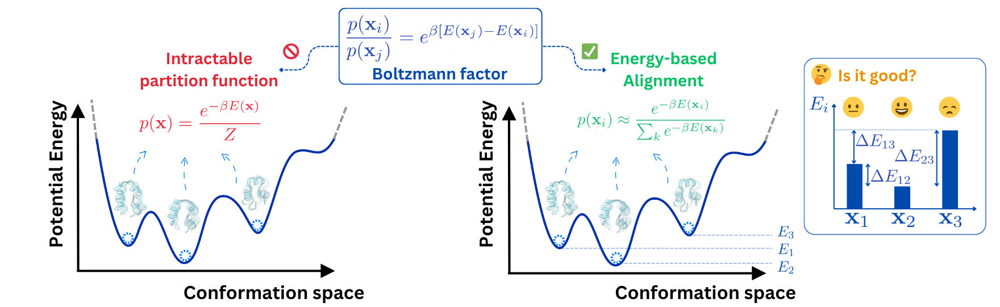

<div align="center">

# Energy-based Alignment (ICML 2025)

<a href="https://pytorch.org/get-started/locally/"></a>
[](https://arxiv.org/abs/2505.24203)
[](https://openreview.net/forum?id=Asr955jcuZ)
[](https://icml.cc/Conferences/2025)

</div>

The official repository of paper [Aligning Protein Conformation Ensemble Generation with Physical Feedback](https://arxiv.org/abs/2505.24203) published in ICML 2025. 

<p align="center">

</p>


Energy-based Alignment (EBA) is an efficient method that aligns generative models with feedback from physical models, calibrating them to appropriately balance conformational states based on their energy differences. Experimental results on the MD ensemble benchmark demonstrate that EBA achieves state-of-the-art performance in generating high-quality protein ensembles. 


## Installation
```bash
git clone https://github.com/lujiarui/eba
cd eba
conda create -n py311 python=3.11 
conda activate py311
pip install -e .

# 
git clone  -b v3.5.1 https://github.com/NVIDIA/cutlass.git ./cutlass
export CUTLASS_PATH=$(pwd)/cutlass
```

## Data preparation
```bash
# get MSA and sequence mapping files
DATA_ROOT_DIR=~/scratch/data/pdb/protenix
mkdir -p $DATA_ROOT_DIR
wget -P ${DATA_ROOT_DIR} https://af3-dev.tos-cn-beijing.volces.com/release_data.tar.gz
tar -xzvf ${DATA_ROOT_DIR}/release_data.tar.gz -C ${DATA_ROOT_DIR}
rm ${DATA_ROOT_DIR}/release_data.tar.gz

# donwload protenix pretrained weights
wget -P ${DATA_ROOT_DIR} https://af3-dev.tos-cn-beijing.volces.com/release_model/model_v0.2.0.pt

# get atlas data
ATLAS_DATA_ROOT_DIR=~/scratch/data/pdb/atlas
bash scripts/download_atlas.sh ${ATLAS_DATA_ROOT_DIR} atlas
python scripts/convert_xtc_to_cif.py --atlas_dir ${ATLAS_DATA_ROOT_DIR} --outdir /tmp/atlas

# prepare processed data
python scripts/prepare_training_data.py -i /tmp/atlas/mmcif -o /tmp/atlas/indices.csv -b /tmp/atlas/bioassembly -d Atlas -n 32
```
*Do not forget to zip and copy them to the hard disk if you need them in the future.* 😄

Following the configuration manner of [Protenix](https://github.com/bytedance/Protenix), one may need to edit the `configs/configs_data.py` to set paths for inference datasets. Specifically,
editing the variables `DATA_ROOT_DIR` and `ATLAS_DATA_ROOT_DIR` (see above), each with the following tree:
```
${DATA_ROOT_DIR}
├── seq_to_pdb_index.json
├── mmcif_msa
├── ...

${ATLAS_DATA_ROOT_DIR}
├── mmcif
├── indices.csv
├── bioassembly
```

## Download EBA checkpoints and artifacts
The trained EBA checkpoints and artifacts can be downloaded from the following links.
- EBA model checkpoint (~3.1GB): https://storage.googleapis.com/project_icml25_eba/release.pt
- Artifacts (250 test samples, in `.cif` format): https://storage.googleapis.com/project_icml25_eba/artifacts.tar.gz


## Inference
To run inference, you can use the following script. **Make sure to edit the bash script `configs/configs_data.py` to set up the data configs**. Refer to `./example/` for the example data structure. 
```bash
# it takes a while to load and compile the kernels for the first runtime
# by default, use the 7 example atlas targets in the ./example/ for demo running
bash sh/sample_demo.sh
```

## Training
To finetune from the pretrained model, one may need to edit the `configs/configs_data.py` to set paths for training datasets, similar to above. **Be sure to edit the bash script \{`sh/finetune_demo.sh`, `sh/eba_demo.sh`\} to set up the running configs**. 
```bash
bash sh/finetune_demo.sh # sft
bash sh/eba_demo.sh # eba
```


## EBA Data Curation
To enable the EBA training, one may need to prepare the EBA data. On top of the ATLAS data, the off-policy EBA data only requires an additional energy_annotation CSV file, which can be generated by the following script. The script will generate the EBA data in the `./example/mmcif` directory, for a toy example:
```bash
# on a single A100 GPU, it takes <1 minutes to annotate the 7 structures.
python scripts/gen_dpo_data.py --input ./example/annotation/mmcif --num_workers 1

# (Optionally) you can process the mmcif again by adding the energy information to the bioassembly dict.
python scripts/prepare_training_data.py -i example/annotation/minimized/openmm_labels.csv -o example/annotation/indices.csv -b example/annotation/bioassembly -d OpenMM -n 4
```
Afterwards, the `example/minimized/minimization_results.csv` should contains the energy information. Specify the `annotation_csv` in the `configs/configs_data.py` to enable the EBA training. If you execute the optional step above, you may not need the annotation_csv in the configs.


## Ensemble Evaluation
To evaluate the inference samples, you may use the following scripts. Note that `${ATLAS_DATA_ROOT_DIR}` contains the ATLAS raw data as you set above, and the `./artifacts/` directory will contain the evaluation results. 
```bash
# Note: CPU heavy job
python scripts/analyze_ensembles.py --pdbdir ./artifacts --atlas_dir ${ATLAS_DATA_ROOT_DIR} --num_workers 32 
python scripts/print_analysis.py ./artifacts/out.pkl 
```


## Preprocess the Embeddings
To accelerate the training, we recommend to pre-process the pairformer embeddings since we will freeze the pairformer module during the training. The pre-processing can be done by the following script (**modify the arguments accordingly**):
```bash
bash sh/encode_demo.sh
```
Then indicate the directory `precomputed_emb_dir` containing all of the `*.pt` files in the `configs/configs_data.py` to enable the pre-computed pairformer embedding.

## Citation
If you find this project useful, please consider citing our work (ICML 2025) 🤓🫰:

```bibtex
@inproceedings{
    lu2025aligning,
    title={Aligning Protein Conformation Ensemble Generation with Physical Feedback},
    author={Jiarui Lu and Xiaoyin Chen and Stephen Zhewen Lu and Aurelie Lozano and Vijil Chenthamarakshan and Payel Das and Jian Tang},
    booktitle={Forty-second International Conference on Machine Learning},
    year={2025},
    url={https://openreview.net/forum?id=Asr955jcuZ}
}
```

## Acknowledgements
The PyTorch model implementation is based upon the [Protenix](https://github.com/bytedance/Protenix) repository, which is an open-source PyTorch reproduction of [AlphaFold 3](https://github.com/google-deepmind/alphafold3); The ATLAS data processing and evaluation is following the [AlphaFlow](https://github.com/bjing2016/alphaflow) codebase.